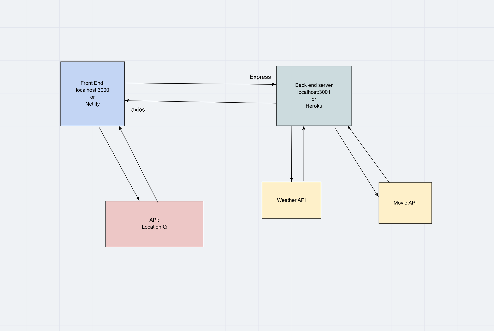

# city-explorer

**Author**: Jessi Velazquez
**Version**: 1.3.0 

## Overview
<!-- Provide a high level overview of what this application is and why you are building it, beyond the fact that it's an assignment for this class. (i.e. What's your problem domain?) -->
This is an app developed for users who want to quickly view a map of a city of their choice, along with a forecast for the local area. User inputs the city and retreives map and weather forecast data from API calls.

## Getting Started
<!-- What are the steps that a user must take in order to build this app on their own machine and get it running? -->
1. Clone Github Repositories for front end and back end
2. install nodemon
3. connect to nodemon for the back end
4. connect to npm for the front end

## Architecture
<!-- Provide a detailed description of the application design. What technologies (languages, libraries, etc) you're using, and any other relevant design information. -->

## Change Log
<!-- Use this area to document the iterative changes made to your application as each feature is successfully implemented. Use time stamps. Here's an examples:

01-01-2001 4:59pm - Application now has a fully-functional express server, with a GET route for the location resource. -->

03-24-2021 11:13pm - Application now pulls location and weather data from API and renders both on bootstrap card. Both front and back end are deployed to Netlify and Heroku, but deplopyed back end does not send weather data to front end. It works when nodemon is running for the server side.

03-25-2021 11:07pm - Application now is now styled on the front end, and weather data is now rendered in a nested React component. Code has also been refactored and cleaned - both front and back ends.

## Credit and Collaborations
Data flow diagram co-developed with Peter Staker.

Name of feature: Search form submit, render map and location data from API

Estimate of time needed to complete: 5 hours

Start time: 1:00pm

Finish time: 9:30pm

Actual time needed to complete: 8.5 hours

Data flow diagram co-developed with Jeremy Brazell.

Name of feature: Weather API

Estimate of time needed to complete: 5 hours

Start time: 1:00pm

Finish time: 7:30pm

Actual time needed to complete: 6.5 hours

Name of feature: Refactor and Nested component

Estimate of time needed to complete: 3 hours

Start time: 5:30pm

Finish time: 7:45pm

Actual time needed to complete: 2.25 hours